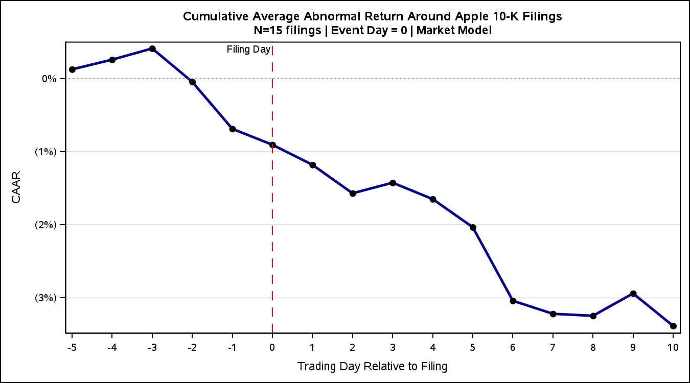
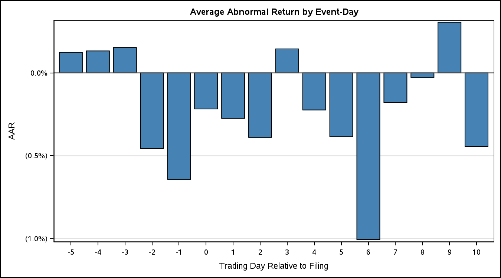
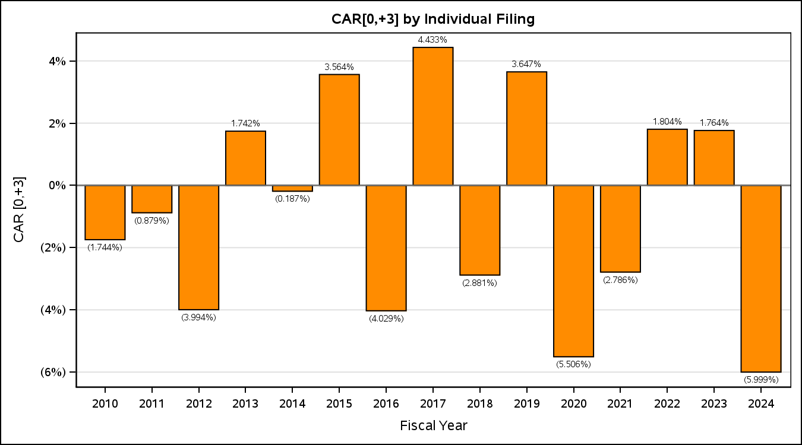

# 🍎 Apple 10-K Sentiment vs Share Price — A SAS Event Study

> **Does the tone of Apple's annual report move its stock? A 15-year event study (2010–2024) using the Loughran-McDonald dictionary, CRSP daily returns, and IBES earnings surprises — built end-to-end in SAS.**


---

## 📌 Overview

A 10-K is the most important regulatory document a public company files. Investors read it for **hard information** (earnings, segment revenue, guidance) — but the document is also full of **soft information**: the tone, hedging, and risk language management chooses to use. A long line of accounting research (Tetlock 2007, Loughran & McDonald 2011, Feldman et al. 2010) finds that negative sentiment in 10-Ks predicts abnormal returns in *aggregate samples* of thousands of firms.

This project asks the same question, deliberately narrowed to a **single firm — Apple**, 2010–2024:

> **Does the negative tone of Apple's 10-K predict its post-filing abnormal returns, after controlling for the earnings surprise that lands at roughly the same time?**

The pipeline pulls every Apple 10-K from EDGAR, scores each one with the Loughran-McDonald financial-sentiment dictionary, pulls AAPL & market returns from CRSP, computes market-model cumulative abnormal returns over four event windows, controls for the IBES earnings surprise, and runs the headline OLS plus five robustness specifications.

---

## 📊 Dataset

| Property | Value |
|---|---|
| **Firm** | Apple Inc. (CIK 0000320193, ticker AAPL) |
| **Period** | Fiscal years 2010 – 2024 |
| **Filings** | 15 annual 10-Ks (one per fiscal year) |
| **Returns** | CRSP daily — AAPL + value-weighted market index |
| **Surprises** | IBES — analyst-consensus EPS surprise & SUE |
| **Dictionary** | Loughran-McDonald Master Dictionary (86,553 words; 2,355 negative; categories: Negative, Positive, Uncertainty, Litigious, Constraining, Superfluous) |
| **Event windows** | CAR[0,+1], CAR[0,+3], CAR[0,+5], CAR[+1,+10] |
| **Estimation window** | [−120, −11] trading days pre-filing for market-model α, β |

---

## 🎯 Headline Result

The main regression is `CAR[0,+3] = β₀ + β₁ · neg_pct + β₂ · surprise_pct`.

| Variable | Coefficient | Std. Err. | t-stat | p-value |
|---|---:|---:|---:|---:|
| Intercept | 0.0196 | 0.0785 | 0.25 | 0.807 |
| **neg_pct** (LM negative word share) | **−0.0197** | 0.0407 | −0.48 | **0.638** |
| surprise_pct (IBES earnings surprise) | 0.7073 | 0.9321 | 0.76 | 0.463 |

**N = 15, R² = 0.079, F = 0.52 (p = 0.61).**

Across **all** robustness specifications — net tone, uncertainty tone, shorter CAR[0,+1], sentiment-alone — the negative-sentiment coefficient is **never statistically significant** at conventional levels.

The **one** significant result in the project is the post-earnings-announcement drift (PEAD) spec:

> `CAR[+1,+10] = β₀ + 1.73 · surprise_pct − 0.04 · neg_pct`, β_surprise **p ≈ 0.042**.

**Interpretation.** For Apple over 2010–2024, the tone of the 10-K does not move the stock — but the **hard** earnings surprise drifts into prices over the following two trading weeks. Soft information (sentiment) does not predict short-term abnormal returns once we control for the hard information that arrives at the same time.

> ⚠️ **The honest caveat:** with N = 15, this is a single-firm null. It is consistent with — but cannot establish — the broader finding that sentiment matters more at the cross-section than the firm-time-series level.

---

## 📈 Results in Pictures

### Negative sentiment vs short-window CAR
Each point is one Apple 10-K (2010–2024). The fitted line is essentially flat — visual confirmation of the −0.020 slope coefficient.


### Sentiment trajectory vs returns trajectory
Negative-word % (right axis, dark red) drifts upward across the decade as Apple's 10-Ks grow longer and more risk-disclosure-heavy. CAR[0,+3] (left axis, dark blue) oscillates around zero with no visible relationship to tone.


### Event-study cumulative abnormal returns
Average CAR across all 15 filings, by trading day around the 10-K release. The 10-K itself is a relative non-event for Apple; the [+1,+10] drift visible here is what the PEAD regression picks up.


---

## 🛠️ Methodology — The SAS Pipeline

| Module | Purpose | Key output |
|---|---|---|
| `01_get_10k_list.sas` | Pull Apple's 10-K filing index from WRDS / EDGAR | `apple_10k_list` |
| `02_download_10k_text.sas` | Download raw 10-K HTML / TXT files | `~/apple_sentiment_project/10k_text/` |
| `02b–02d` | Extraction QA, regex cleanup, finalize one row per fiscal year | `apple_10k_clean` |
| `03_score_sentiment.sas` | Tokenize, match against LM dictionary, compute `neg_pct`, `pos_pct`, `unc_pct`, `lit_pct`, `net_tone` | `apple_sentiment` |
| `04_pull_returns.sas` | CRSP daily returns for AAPL + value-weighted market | `apple_returns` |
| `05_pull_earnings_surprise.sas` (+ `05b_fix`) | IBES consensus, actual EPS, surprise %, SUE | `aapl_surprise` |
| `06_event_study.sas` (+ `06b`, `06c`) | Estimate market-model α, β on [−120,−11]; compute CARs on [0,+1], [0,+3], [0,+5], [+1,+10] | `apple_car` |
| `07_regression.sas` | Merge sentiment + CAR + surprise; run main OLS + 5 robustness specs + scatter & trajectory plots | `analysis_data`, regression output |

Each module is idempotent and writes to a shared `proj` library so steps can be re-run independently.

---

## 🧪 Tech Stack

| Layer | Tools |
|---|---|
| **Language** | SAS 9.4 / SAS Studio |
| **Data warehouse** | WRDS (CRSP, IBES) |
| **Text source** | SEC EDGAR (10-K full-text submissions) |
| **Dictionary** | Loughran-McDonald Master Dictionary (LM 2024 release) |
| **Procedures** | `proc sql`, `proc reg`, `proc means`, `proc corr`, `proc sgplot`, `proc expand` |

---

## 📂 Repository Structure

```
apple-10k-sentiment-event-study/
├── README.md
├── code/
│   ├── 01_get_10k_list.sas
│   ├── 02_download_10k_text.sas
│   ├── 02b_check_extraction.sas
│   ├── 02c_extract_text_v2.sas
│   ├── 02d_finish.sas
│   ├── 03_score_sentiment.sas
│   ├── 04_pull_returns.sas
│   ├── 05_pull_earnings_surprise.sas
│   ├── 05b_fix_surprise.sas
│   ├── 06_event_study.sas
│   ├── 06b_event_study_fix.sas
│   ├── 06c_fix_charts.sas
│   └── 07_regression.sas
├── data/
│   └── LM_MasterDictionary.csv
├── results/
│   ├── 01_get_10k_list-results.pdf
│   ├── 02b_check_extraction-results.pdf
│   ├── 03_score_sentiment-results.pdf
│   ├── 04_pull_returns-results.pdf
│   ├── 05b_fix_surprise-results.pdf
│   ├── 07_regression-results.pdf
│   └── charts/
│       ├── sentiment_vs_car.png
│       ├── sentiment_trajectory.png
│       └── event_study_car.png
└── docs/
    ├── Apple_10K_Sentiment_Deck.pptx
    └── Apple_10K_EventStudy_OtherMaterial.xlsx
```

---

## ▶️ How to Reproduce

1. **Access**: an active **WRDS** account with CRSP + IBES subscriptions, and a SAS 9.4 / SAS Studio environment.
2. **Library**: create a permanent library `libname proj "~/apple_sentiment_project";` (each module references this).
3. **Run order**: execute the SAS files in numeric order — `01` → `02` → `02b/c/d` → `03` → `04` → `05` → `05b` → `06` → `06b` → `06c` → `07`. Each module checks its inputs and writes to `proj`, so re-runs are safe.
4. **Dictionary**: `data/LM_MasterDictionary.csv` is the 2024 Loughran-McDonald release — point `03_score_sentiment.sas` at this file.

---

## ⚠️ Limitations & Honest Framing

- **N = 15 filings.** A single-firm time series. Any conclusion (significant or null) is fragile and the standard errors are wide.
- **No hard-vs-soft *negative-word* split.** This study models *one* aggregate negative-sentiment variable (`neg_pct`). The "hard vs soft" distinction in the headline refers to **hard information (earnings surprise) vs soft information (10-K tone)** — not to a severity split inside the LM negative list. Splitting negative words into e.g. *litigious + constraining* (hard) vs *remaining negatives* (soft) would be a natural extension.
- **Apple-specific external context.** Apple's filings are heavily templated and risk-section-bloated; tone may be especially uninformative for this firm relative to a cross-sectional sample.
- **No multi-firm benchmark.** The classic Tetlock (2007) / Loughran-McDonald (2011) results hold at the *cross-section*. This project intentionally narrows to one firm; the null result here does not contradict the broader literature.

---

## 👤 Author

**Feroz Obaid Khan** — McGill MMA, ACCT 626 (Data Analytics in Accounting), Winter 2026.
Team: Chloee, Feroz, Hank, Henry.
